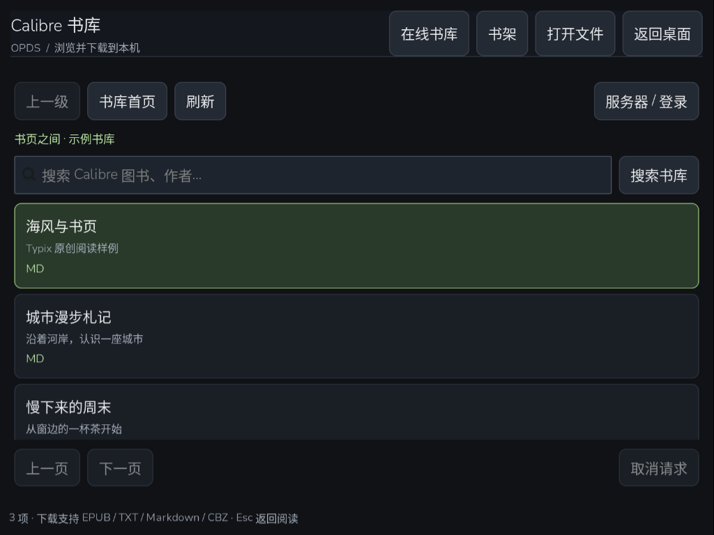

# TypixReader 0.3

面向 TypixDeck CM4 小屏和键盘的原生 GTK3 阅读器。支持官方 Raspberry Pi OS ARM64 Bookworm / Trixie；界面默认全屏，不需要浏览器或 Node；本地阅读可完全离线。

<!-- app-screenshots:start -->


最近书架与继续阅读。


原创短文《海风与书页》的阅读界面。




使用原创条目的 OPDS 演示书库。

<!-- app-screenshots:end -->

## 已实现

- 可点击、可键盘操作的最近书架，直接继续上次阅读；最多展示 20 本本地图书。
- 文件选择、命令行 `.desktop %f` 打开和本地文件拖入；取消载入后恢复当前图书。
- TXT / Markdown：UTF-8（含 BOM）、GB18030、Big5；Markdown 一级至三级标题生成目录，正文以可读纯文本显示。
- EPUB：按 OPF spine 顺序读取本地 XHTML 文字，保留行内文字顺序、抽取章节标题，长章分段；不执行脚本、加载远程图片或使用 EPUB CSS。
- CBZ：数字自然顺序排列图片页，逐页后台读取和解码，按当前可用宽高适配；不会把整本漫画的图片载入内存。
- 全书文字搜索、结果高亮和循环查找；目录跳转；16–34 px 字号。
- 记忆章节 / 漫画页和正文视口顶部字符位置；字体偏好保存在本机。
- 打开、解析、搜索和漫画解码在可取消的后台工作线程执行；过期任务不能覆盖新图书。
- 文件缺失、权限不足、格式损坏、加密、资源超限均显示可恢复提示；打开失败保留当前图书。
- 写入失败时可继续阅读并提示检查存储 / 权限，之后继续尝试保存。状态原子替换失败时保留旧文件。

本阶段支持 TXT、MD / Markdown、EPUB、CBZ。PDF、CBR、MOBI / AZW、FB2、TTS、EPUB 排版 / 内嵌图片尚未实现，不能用这个版本替代它们的系统阅读器。

## Calibre 在线书库

点击“在线书库”，输入自己 Calibre Content server 的 OPDS 地址；地址仅含服务器根目录时会补上 `/opds`。用户名和密码可以留空，受保护书库使用独立登录字段。支持 HTTP / HTTPS 和 Calibre 的 Basic / Digest 认证；HTTPS 使用系统证书验证，不提供忽略证书的开关。没有内置书库或测试服务器。

- 浏览 OPDS 1 Atom 分类和图书详情，通过面包屑返回分类；按服务器链接切换前后页。
- 搜索标题、作者以及服务器支持的 Calibre 查询；兼容直接查询链接与 OpenSearch 模板。
- EPUB、TXT、Markdown、CBZ 可下载到本机并立即交给现有阅读器打开，随后正常保存阅读进度；本地同名图书不会被覆盖。
- PDF、MOBI / AZW 等不支持的格式显示明确提示；借阅、付费与 OPDS 2 尚不支持。
- 目录、登录、搜索和下载都在后台执行。取消、断网、认证失败、服务器限流或磁盘不足时保留正在阅读的图书；可刷新、重试或重新登录。

账号密码只保留在当前应用会话内。`opds.json` 只保存标准 `/opds` 地址，不保存登录信息；自定义路径可能含令牌，因此不会记住，也不接受 URL 中的账号密码或查询令牌。所有目录、下载和重定向必须保持同一来源，避免把登录信息发送给其他服务器。只在用户操作时请求对应书库，不发送本地图书或阅读记录，不读取环境代理设置。

协议依据：[Calibre Content server 文档](https://manual.calibre-ebook.com/server.html)和 [OPDS 1.2 规范](https://specs.opds.io/opds-1.2.html)。

## 键盘

| 操作 | 快捷键 |
| --- | --- |
| 打开本地文件 | Ctrl+O |
| 选择按钮 / 图书 | Tab / Shift+Tab，Enter |
| 上一 / 下一章节，或漫画页 | ← / →（正文或图片获得焦点时） |
| 向上 / 下滚动一屏，章尾进入下一章 | PageUp / PageDown，Shift+Space / Space |
| 目录 | Ctrl+T；目录内 ↑ / ↓ 跳章 |
| 搜索全文 | Ctrl+F；Enter / F3 查找下一个 |
| 调整字号 | Ctrl+− / Ctrl++ |
| 关闭搜索 / 返回书架，再返回桌面 | Esc |
| 在线书库取消请求 / 返回原来图书 | Esc |
| 保存进度并返回桌面 | Ctrl+Q，或右上角“返回桌面” |
| 重新请求全屏 | F11 |

在文件选择器内，取消只关闭选择器。在后台打开过程中，Esc 或“取消”回到原来的阅读界面。

## 数据与资源边界

状态文件：`~/.local/share/typix-reader/state.json`（遵循 `XDG_DATA_HOME`），也可通过 `TYPIX_READER_STATE` 指定隔离测试路径。只保存本地图书路径、书名、内容 SHA-256、进度和字号，不上传。兼容 0.1 的最近列表和阅读进度；文件权限 0600，保留最多 200 份图书进度。

在线下载存放于同一数据目录的 `downloads/`，使用 0600 临时文件完整写入后原子发布；不覆盖任何已有文件。OPDS 目录最多 2 MiB / 250 项，XML 最多 32 层 / 10,000 个节点且禁止 DTD / 实体。下载最多 128 MiB，开始前至少需要 144 MiB 可用空间。连接响应头等待最多 30 秒，目录请求最多 40 秒，下载最多 300 秒；单次网络读取最多等待 10 秒。HTTP 429 / 503 根据 Retry-After 最多暂停 60 秒，之后可手动重试。

为了控制 CM4 的内存和解码负担：

- 图书文件最多 256 MB，独立文本最多 16 MB。
- ZIP 最多 5,000 个文件，声明的总展开大小最多 256 MB，单成员最多 32 MB；加密或重复成员名拒绝打开。
- EPUB 单份 markup 最多 8 MB，累计正文源文件最多 32 MB；单个显示段落最多 12,000 个字符。
- 所有格式最多 1,000 个显示章节 / 漫画页，章节标题最多 200 字符；Markdown 惰性遍历标题并在每次分章时检查取消，超限文件在进入 GTK 目录前拒绝。
- 漫画每次只解码一页，单页最多 6,400 万像素，并按视口缩放。
- XML 元数据禁止 DTD / 实体；EPUB 正文章节只能引用压缩包中的本地路径。ZIP 不解压到磁盘。

后台取消是协作式的：本地文件分块读取和章节之间会检查取消标记；系统文件 I/O 和当前解码器调用完成后才能结束正在执行的那一步。UI 可立即离开载入页，陈旧回调会被丢弃。

## 与 Launcher 集成

包安装标准入口 `/usr/share/applications/typix-reader.desktop`，由桌面快捷方式选择性加入 Launcher。包本身不遍历应用列表，也不自行创建用户桌面文件。

`Exec=/usr/bin/typix-reader %f` 保留文件参数；`GLib.set_prgname(ai.typixdeck.reader)` 固定 Wayland app ID。窗口在显示前请求全屏，并在首次 map 后补发一次，兼容 CM4 的 labwc 窗口创建时序。通过 `X-TypixDeck-FullscreenAppId=ai.typixdeck.reader` 配合 Launcher 的应用生命周期和桌面恢复。

应用不自动连接书库或 NAS，也不上传图书。

## 构建与验证

```sh
PYTHONPATH=src python3 -m unittest discover -s tests -v
./build-deb.sh
```

产物为 `dist/typix-reader_0.3.0-1_all.deb`。纯 Python 包声明 `Architecture: all`；依赖 `python3 (>= 3.11), python3-gi, gir1.2-gtk-3.0, gir1.2-gdkpixbuf-2.0, ca-certificates`；control 字段 `X-Typix-Compatible-OS: raspios-bookworm,raspios-trixie` 用于 Registry 严格匹配。CM4 ARM64 是主验收目标，其它硬件不作型号假设。

在真机已登录的 GTK3 / Wayland 会话中执行隔离 QA（输出目录应为专用测试目录）：

```sh
PYTHONPATH=src READER_QA_SCREENSHOT_COMMAND=grim /usr/bin/python3 tests/gtk_smoke.py /tmp/typix-reader-qa
PYTHONPATH=src READER_QA_SCREENSHOT_COMMAND=grim /usr/bin/python3 tests/gtk_opds_smoke.py /tmp/typix-reader-opds-qa
```

脚本使用独立 QA Application ID、临时图书和单独状态文件，验证全屏、书架、目录、跨章搜索、字号、滚动续读、CBZ 顺序 / 视口适配 / 续读、文件缺失及取消恢复；输出 `result.json` 和截图。未设置截图环境变量时不调用 `grim`。测试不会读取现有用户书架。

本次验证通过 47 项单元测试、21 项原有 GTK 检查和 19 项 OPDS GTK 检查，覆盖 Basic / Digest、分类、搜索、分页、XML / 下载资源限制、跨源拒绝、慢响应头取消、下载后打开、旧文件保护和本地阅读回归。CM4 真机还通过临时用户书库的主页、分类、分页、命中搜索以及 EPUB 格式链接检查；该服务的无结果搜索返回 HTTP 404、部分分类返回 HTTP 500，客户端显示可恢复错误。未从该服务器下载或公开图书内容；完整下载流程使用受控原创测试文件验证。

`tests/gtk_opds_showcase.py` 使用自创短文和本机演示目录生成书架、阅读、在线书库截图；不读取现有用户书架。截图为 CM4 物理 1024×768、逻辑约 801×601 的实际 GTK 输出。

## 仓库目录

| 路径 | 用途 |
| --- | --- |
| `app.json` | 应用描述、完整 deb 版本与 SHA-256、截图索引 |
| `README.md` | 功能、真机截图、安装与使用说明 |
| `src/` | 当前程序源码或启动入口 |
| `packaging/` | desktop 与打包辅助文件 |
| `tests/` | 功能与边界验证 |
| `docs/screenshots/` | 可公开的真实运行截图 |
| `build-deb.sh` | 本地构建入口 |
| `dist/` | 构建生成的完整 deb；不提交 Git |

构建后核对并更新 `app.json` 的版本、SHA-256 和截图索引。Store 发布工具读取声明并校验完整软件包；构建不会自动签名、上传或安装。 发布格式见 [应用仓库约定](https://github.com/typixdeck/store/blob/main/docs/APP-REPOSITORY.md)。应用仓库不包含用户数据、凭据、私钥或设备采集记录。
